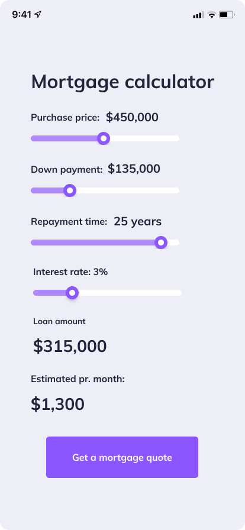

# mortgage_calculator_app

A mortgage calculator mobile application. It is a Flutter project

## Requirements

Users can set purchase prices
Users can set down payment
Users can set repayment time
Users can set interest rate
Show users loan amount (purchase price - down payment)
Show users the estimated amount they'll pay on a monthly basis

## Visual

[Video](assets/mortgage_calculator_video.webm)